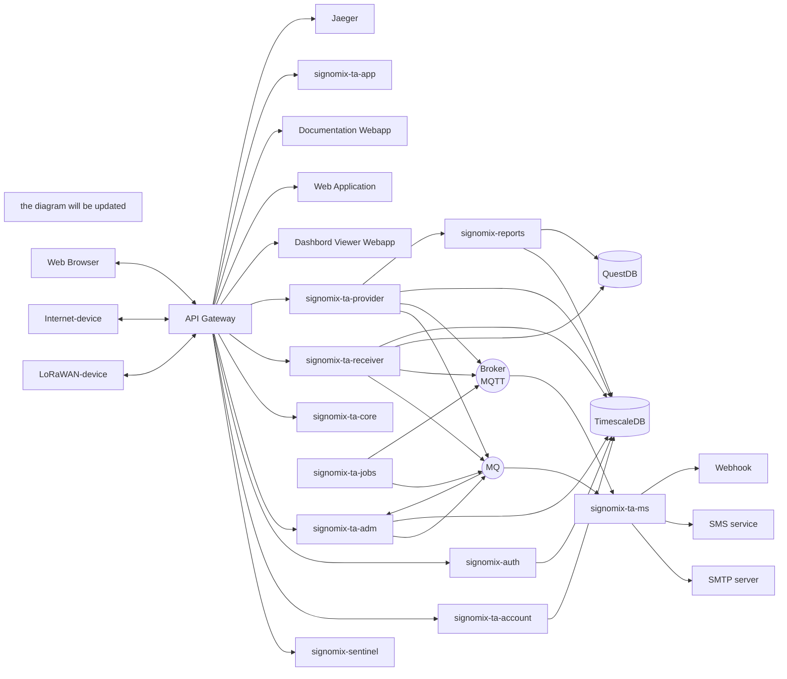

# Signomix IoT Platform (target architecture)

**IoT & data management platform**

## Requirements

For Signomix development you need:
- Git
- Java 17
- Maven
- npm
- Docker (with compose plugin)

To initialize environment and run from Docker images locally you need:
- Git
- Docker (with compose plugin)

## Cloning the main repository

```shell
git clone https://github.com/signomix/signomix.git
cd signomix
```

## Running Docker images

Before running you need to create folder structure required for data storage. To do this tun the script:

```shell
sh init-runtime-environment.sh
```
Run services with Docker Compose:

```shell
docker compose --env-file ./public.env up -d
```

## Building and running from source

Clone and initialize required repositories:

```shell
sh init-dev-environment.sh
```

Build images:

```shell
sh build-images.sh ./dev.cfg
```

Start the service with docker compose:

```shell
docker compose --env-file ./dev.env up -d
```

## Architecture

> TO BE UPDATED

The target platform architecture consist of the microservices listed below. 

|Component|Version|Description|
|---|---|---|
|signomix-apigateway|||
|[signomix-ta-account](https://github.com/signomix/signomix-ta-account)|||
|[signomix-auth](https://github.com/signomix/signomix-auth)|||
|[signomix-ta-app](https://github.com/signomix/signomix-ta-app)|1.0.3|Web GUI version 1.x - deprecated|
|signomix-comon|||
|signomix-ta-core|||
|signomix-ta-jobs|||
|[signomix-ta-receiver](https://github.com/signomix/signomix-ta-receiver)||IoT data receiver service|
|[signomix-ta-provider](https://github.com/signomix/signomix-ta-provider)||IoT data provider service|
|signomix-sentinel|||
|signomix-mq|1.0.0|Message broker|
|[signomix-ta-ms](https://github.com/signomix/signomix-ta-ms)|1.0.0|Messaging service|
|[signomix-database](https://github.com/signomix/signomix-database)|1.0.5|Database|
|[signomix-ta-adm](https://github.com/signomix/signomix-ta-adm)||Administration: the service management|
|signomix-webapp|||
|signomix-docs-website|||
|signomix-documentation|||
|signomix-view|||
|[signomix-main](https://github.com/signomix/signomix-main)|1.3.0|Previous version. Deprecated, will be removed soon|




