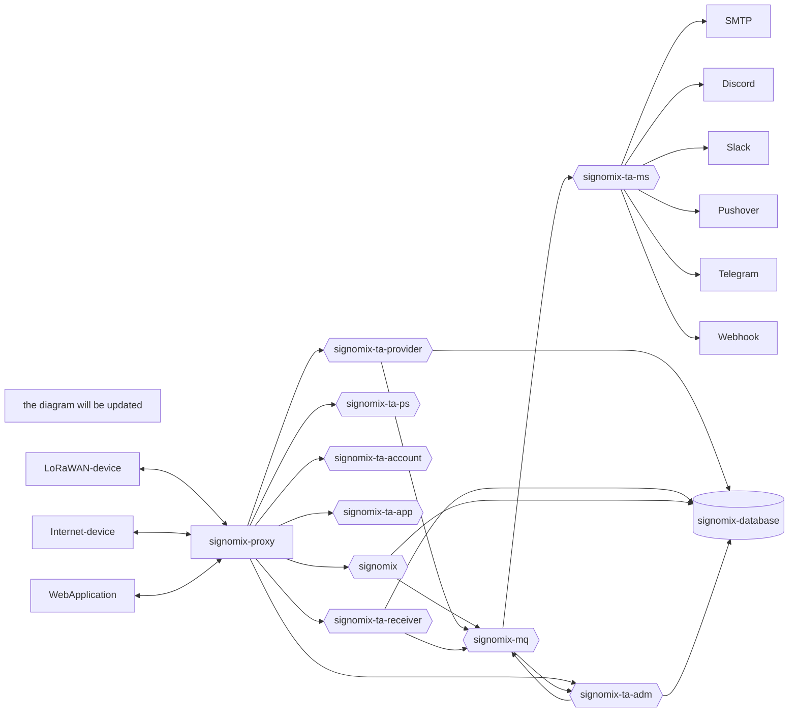

# Signomix IoT Platform (target architecture)

## v. 1.3.0

**IoT & data management platform**

>*Signomix is in the process of refactoring, including migration to the latest version of Cricket MSF and splitting it into a set of microservices. Stay tuned.*

## Installation

### Installing from source

#### Requirements
- Git
- Java 13 (17 recommended)
- Maven
- npm
- Docker
- Docker Compose

#### Steps

1. Clone the main project from GitHub

```shell
git clone https://github.com/signomix/signomix-ta.git
```

2. Clone and initialize required repositories

> Review `init.sh` and:

```
cd signomix-ta
sh init.sh
```

3. Configure

> TO BE DESCRIBED

4. Build 

```shell
sh build-images.sh ./dev.cfg
```

5. Start the service with docker-compose

```shell
docker compose --env-file ./dev.env up -d
```

## Architecture

> TO BE UPDATED

The target platform architecture consist of the microservices listed below. 

|Component|Version|Description|
|---|---|---|
|[signomix-ta-account](https://github.com/signomix/signomix-ta-account)|||
|[signomix-ta-app](https://github.com/signomix/signomix-ta-app)|1.0.3|Web GUI|
|[signomix-ta-receiver](https://github.com/signomix/signomix-ta-receiver)||IoT data receiver service|
|[signomix-ta-provider](https://github.com/signomix/signomix-ta-provider)||IoT data provider service|
|signomix-mq|1.0.0|Message broker|
|[signomix-ta-ms](https://github.com/signomix/signomix-ta-ms)|1.0.0|Messaging service|
|[signomix-ta-ps](https://github.com/signomix/signomix-ta-ps)|1.2.0.10|Public service (home page, blog)|
|[signomix-proxy](https://github.com/signomix/signomix-proxy)|1.1.2|Reverse Proxy & API Gateway service|
|[signomix-database](https://github.com/signomix/signomix-database)|1.0.5|Database|
|[signomix-ta-adm](https://github.com/signomix/signomix-ta-adm)||Administration: the service management|
|[signomix](https://github.com/signomix/signomix)|1.3.0|Previous version containing the following components functionalities: signomix-ta-provider, signomix-ta-receiver, signomix-ta-adm.|




