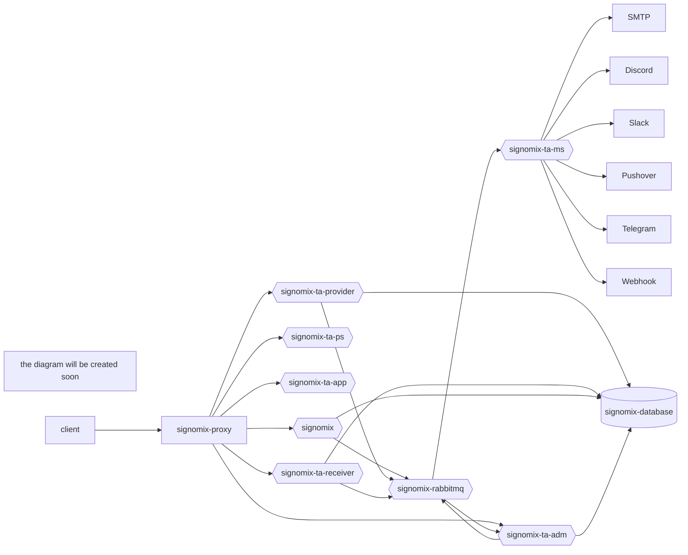

# Signomix IoT Platform (target architecture)

**IoT & data management platform**

>*Signomix is in the process of refactoring, including migration to the latest version of Cricket MSF and splitting it into a set of microservices. Stay tuned.*

The target platform architecture will consist of the microservices listed below. 

|Component|Version|Description|
|---|---|---|
|[signomix-ta-app](https://github.com/signomix/signomix-ta-app)||Web GUI|
|[signomix-ta-receiver](https://github.com/signomix/signomix-ta-receiver)||IoT data receiver service|
|[signomix-ta-provider](https://github.com/signomix/signomix-ta-provider)||IoT data provider service|
|[signomix-ta-rabbitmq](https://github.com/signomix/signomix-ta-rabbitmq)||Message broker|
|[signomix-ta-ms](https://github.com/signomix/signomix-ta-ms)||Messaging service|
|[signomix-ta-ps](https://github.com/signomix/signomix-ta-ps)||Publication service|
|[signomix-proxy](https://github.com/signomix/signomix-proxy)||Reverse Proxy & API Gateway service|
|[signomix-common-library](https://github.com/gskorupa/signomix-common-library)||Java library used by other components|
|[signomix-database](https://github.com/signomix/signomix-database)||Administration: the service management|
|[signomix-adm](https://github.com/signomix/signomix-ta-adm)||Administration: the service management|
|[signomix](https://github.com/signomix/signomix)|1.2.226|Previous version containing the following components functionalities: signomix-ta-provider, signomix-ta-receiver, signomix-ta-adm.|

> Use mermaid-diagrams Chrome extension to render the diagram 

