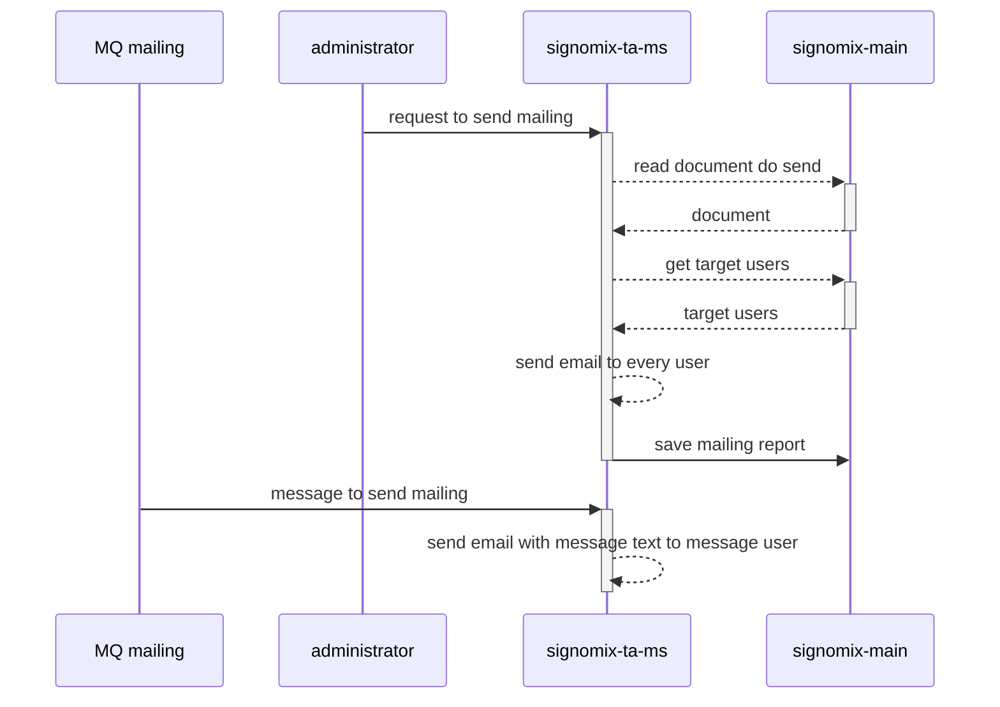

# Mailing

## Scheduled tasks

```mermaid
sequenceDiagram
  participant Q as MQ mailing
  participant A as administrator
  participant M as signomix-ta-ms
  participant S as signomix-main
  A->>+M: request to send mailing
  M-->>+S: read document do send
  S-->>-M: document
  M-->>+S: get target users
  S-->>-M: target users
  M-->>M: send email to every user
  M->>-S: save mailing report
  Q->>+M: message to send mailing
  M-->>-M: send email with message text to message user
```
