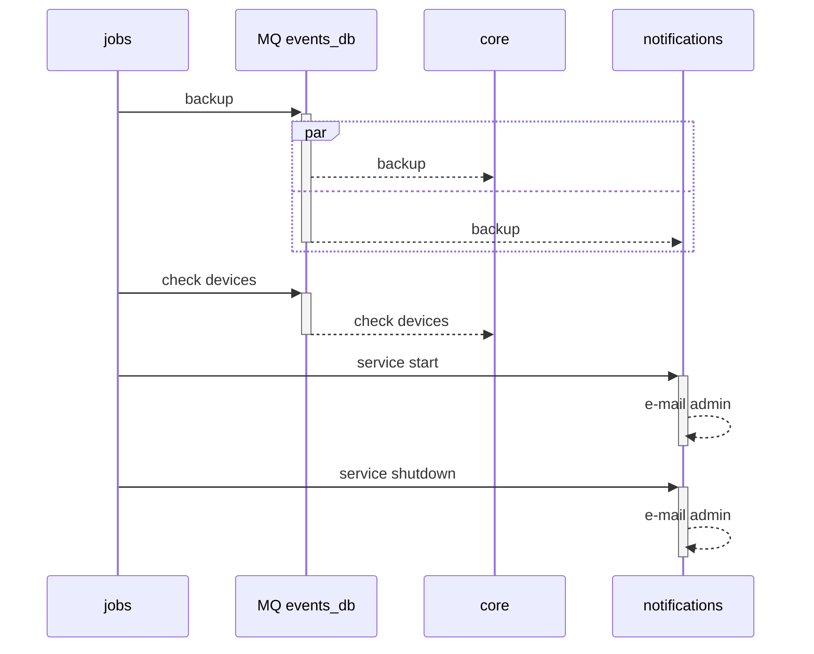
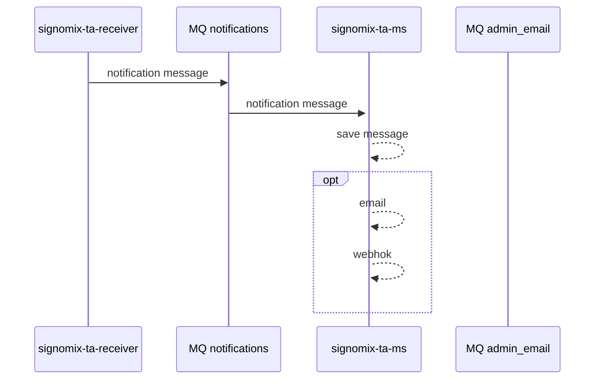

# Messaging 

## Scheduled tasks

```mermaid
sequenceDiagram
    participant jobs
    participant ev_db as MQ events_db
    participant core
    participant notifications
    jobs->>+ev_db: backup
    par
      ev_db-->>core: backup
    and
      ev_db-->>-notifications: backup
    end
    jobs->>+ev_db: check devices
    ev_db-->>-core: check devices
    jobs->>+notifications: service start
    notifications-->>-notifications: e-mail admin
    jobs->>+notifications: service shutdown
    notifications-->>-notifications: e-mail admin
```
## Notifications

```mermaid
sequenceDiagram
    participant receiver as signomix-ta-receiver
    participant B as MQ notifications
    participant C as signomix-ta-ms
    participant D as MQ admin_email
    receiver->>B: notification message
    B->>+C: notification message
    C-->>C: save message
    opt
      C-->>C: email
      C-->>C: webhok
    end
```