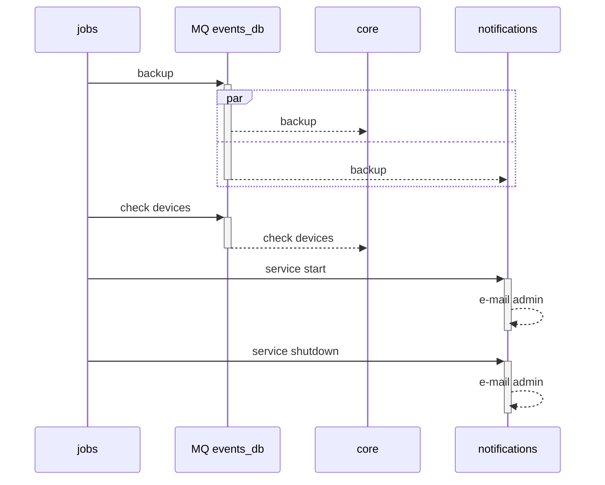
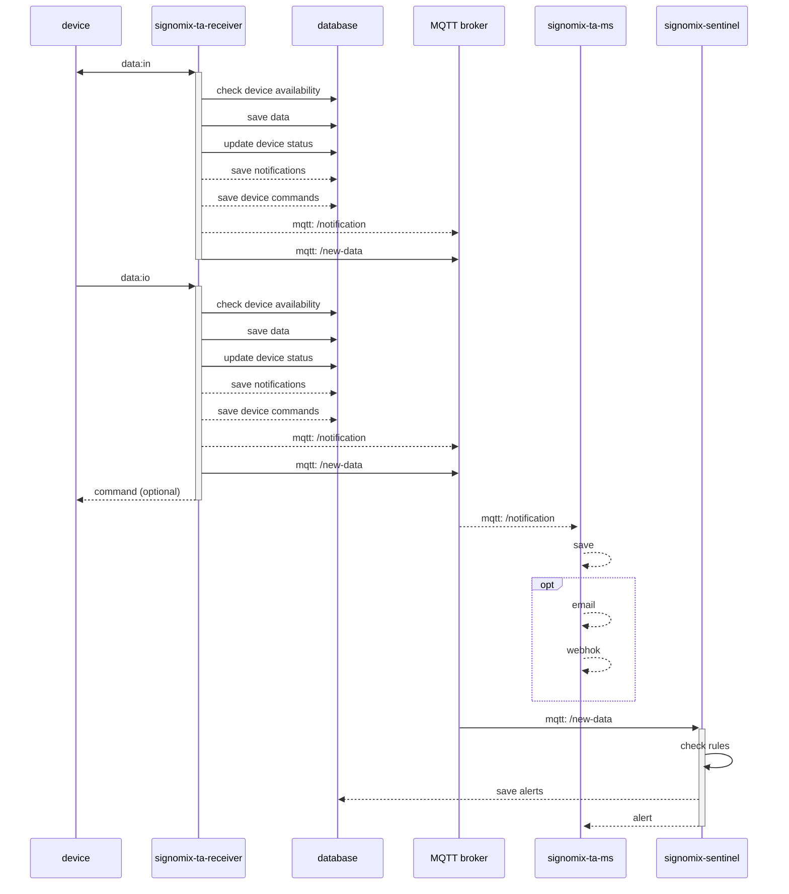

# Messaging 

## Scheduled tasks

```mermaid
sequenceDiagram
    participant jobs
    participant ev_db as MQ events_db
    participant core
    participant notifications
    jobs->>+ev_db: backup
    par
      ev_db-->>core: backup
    and
      ev_db-->>-notifications: backup
    end
    jobs->>+ev_db: check devices
    ev_db-->>-core: check devices
    jobs->>+notifications: service start
    notifications-->>-notifications: e-mail admin
    jobs->>+notifications: service shutdown
    notifications-->>-notifications: e-mail admin
```
## New sensor data handling

```mermaid
sequenceDiagram
    participant device as device
    participant receiver as signomix-ta-receiver
    participant D as database
    participant B as MQTT broker
    participant C as signomix-ta-ms
    participant F as signomix-sentinel
    device<<->>+receiver: data:in
    receiver->>D: check device availability
    receiver->>D: save data
    receiver->>D: update device status
    receiver-->>D: save notifications
    receiver-->>D: save device commands
    receiver-->>B: mqtt: /notification
    receiver->>-B: mqtt: /new-data
    device->>+receiver: data:io
    receiver->>D: check device availability
    receiver->>D: save data
    receiver->>D: update device status
    receiver-->>D: save notifications
    receiver-->>D: save device commands
    receiver-->>B: mqtt: /notification
    receiver->>B: mqtt: /new-data
    receiver-->>-device: command (optional)
    B-->>+C: mqtt: /notification 
    C-->>C: save
    opt
      C-->>C: email
      C-->>C: webhok
    end
    B->>+F: mqtt: /new-data
    F->>F: check rules
    F-->>D: save alerts
    F-->>-C:alert


```